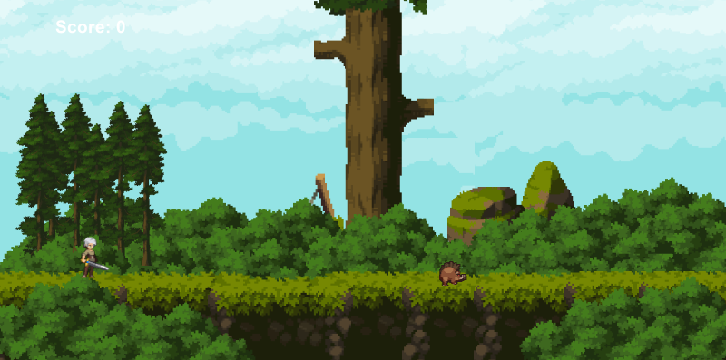

<p align="center">

  <h2 align="center" >🌿 Forest Defender</h2>
</p>


<p align="center">
  <a href="https://github.com/dhnnnn/Forest-Defender/graphs/contributors">
      
    </a>
  
  <a href="https://github.com/dhnnnn/Forest-Defender/watchers">
  
</a>

  <a href="https://github.com/dhnnnn/Forest-Defender/pulls">
      
    </a>
<br/>
<a href="https://github.com/dhnnnn/Forest-Defender/network/members">
  
</a>

<a href="https://github.com/dhnnnn/Forest-Defender/stargazers">
  
</a>
</p>


**Forest Defender** adalah game platformer 2D yang dikembangkan menggunakan **Greenfoot**.  
Pemain berperan sebagai seorang penjaga hutan yang harus melindungi wilayahnya dari serangan musuh dengan cara berlari, melompat, dan menghindari rintangan untuk mendapatkan skor tertinggi. 🌳  


# 🎮 Fitur Utama

🧍‍♂️ **Karakter Utama** — Dapat bergerak ke kiri dan kanan serta melompat.  
- 👾 **Musuh (Enemy)** — Bergerak secara otomatis dan dapat mengakhiri permainan saat bersentuhan dengan pemain.  
- 🧱 **Ground System** — Karakter dapat berdiri, berjalan, dan melompat di atas platform.  
- 🧮 **Sistem Skor** — Skor bertambah setiap kali pemain berhasil melewati musuh atau mencapai jarak tertentu.  
- 💀 **Game Over Screen** — Muncul saat karakter terkena musuh.

## 🚀 Cara Menjalankan Proyek

1. Pastikan kamu sudah menginstal **Greenfoot**.  
   > Unduh di: [https://www.greenfoot.org/download](https://www.greenfoot.org/download)

2. Clone repository ini:
   ```bash
   git clone https://github.com/username/forest-defender.git
  3. Buka folder proyek di Greenfoot.
  4. Klik tombol **Run** untuk mulai bermain. 🕹️
  
## 🧠 Tujuan Pengembangan

Proyek ini dibuat sebagai latihan untuk memahami konsep dasar dalam **game development**, khususnya menggunakan Greenfoot, seperti:
-   Deteksi tumbukan (_collision detection_)
    
-   Animasi sprite
    
-   Manajemen objek (_Actor_ dan _World_)
    
-   Sistem skor dan logika game over


